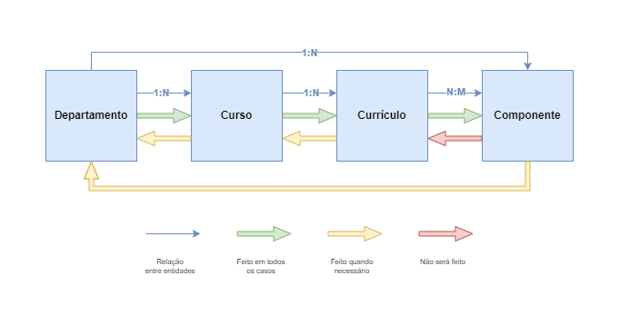

# UnB Ágil

## Pacotes

- [Scraper](./packages/scraper/README.md)
- [API](./packages/api/README.md)

## Ambiente de desenvolvimento

### Configurações gerais iniciais

#### NVM

Para facilitar a gestão de versões do Node.js em diferentes projetos, é sugerida a utilização do [Node Version Manager](https://github.com/nvm-sh/nvm).

Depois de instalar o NVM, navegue até o diretório do projeto e execute o comando abaixo para usar a versão correta do Node.js especificada no arquivo .nvmrc:

```bash
nvm use
```

Se a versão do Node.js especificada no arquivo .nvmrc não estiver instalada, você pode instalá-la com o seguinte comando:

```bash
nvm install
```

#### Yarn

O Yarn é utilizado como gerenciador de pacotes neste projeto. Para instalá-lo, siga as instruções abaixo:

Instale o Yarn globalmente:

```bash
npm install -g yarn
```

Instale as dependências do projeto:

```bash
yarn install
```

#### Configuração do VSCode

Recomenda-se utilizar a extensão Prettier para formatação de código. As configurações recomendadas para extensões estão no arquivo .vscode/extensions.json.

### Mensagens de commit

As mensagens de _commit_ seguem o padrão [Conventional Commits](https://www.conventionalcommits.org/) (`tipo(escopo): descrição`) com os seguintes escopos específicos do projeto:

- `api` API;
- `db` Banco de dados;
- `hist` Histórico acadêmico;
- `rec` Recomendação de disciplinas;
- `scraper` Web scraping do SIGAA;
- `web` Front-end;

## Scraper

<p align="center">
  
</p>

## Algoritmo de recomendação

### Entrada

- **Quantidade máxima de créditos por período**: Cada currículo possui uma carga horária máxima diferente;
- **Disciplinas pendentes**: Código das disciplinas que devem ser cursadas.

### Saída

- **Recomendação**: Lista de períodos com as disciplinas que devem ser cursadas.

### Etapas

1. **Gerar grafo (DAG)**: O grafo representa as disciplinas e seus pré-requisitos. Cada nó é uma disciplina e cada aresta indica uma dependência. Os pré-requisitos, co-requisitos e disciplinas equivalentes devem ser escolhidos seguindo a prioridade:

   1. Maior quantidade de disciplinas obrigatórias no currículo: _reaproveita disciplinas que serão cursadas_;
   2. ~~Maior quantidade de turmas~~ (`MVP2`): _flexibiliza a grade horária_;
   3. Menor carga horária.

2. **Gerar fluxo**: O fluxo representa as disciplinas que devem ser cursadas na menor quantidade de períodos possível. Cada período deve ter no máximo a quantidade de créditos especificada. As disciplinas devem ser ordenadas seguindo a prioridade:
   1. Maior quantidade de períodos bloqueados: _aumenta a prioridade de disciplinas optativas que bloqueiam vários semestres_.
   2. Menor período recomendado no fluxo padrão do currículo: _aproxima a recomendação do fluxo padrão do currículo_.
